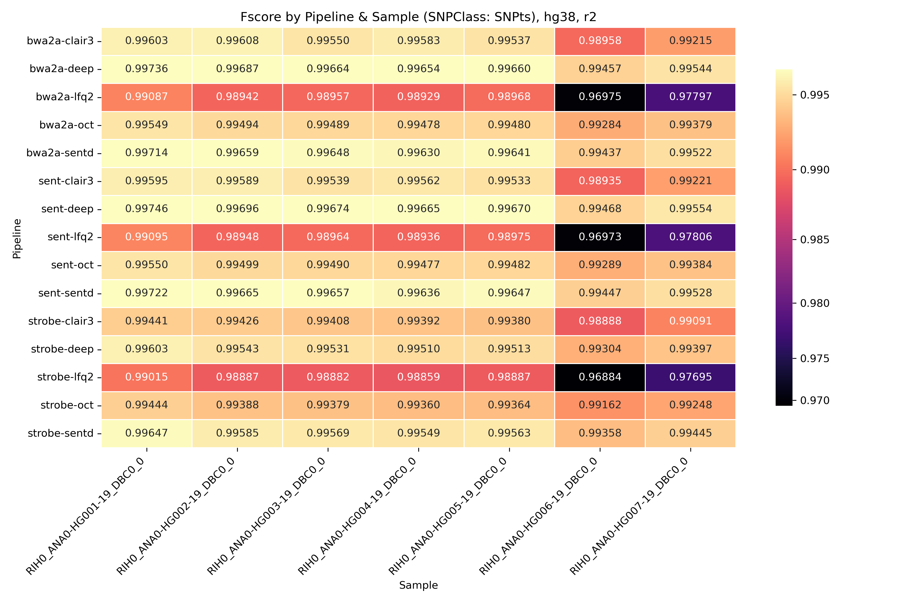
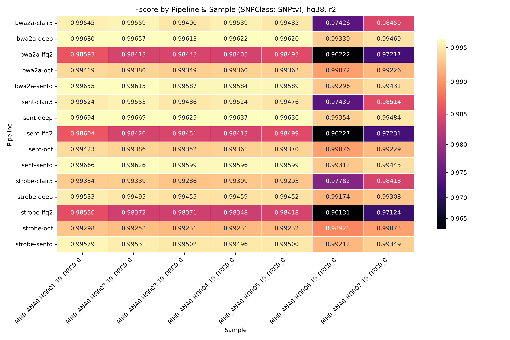
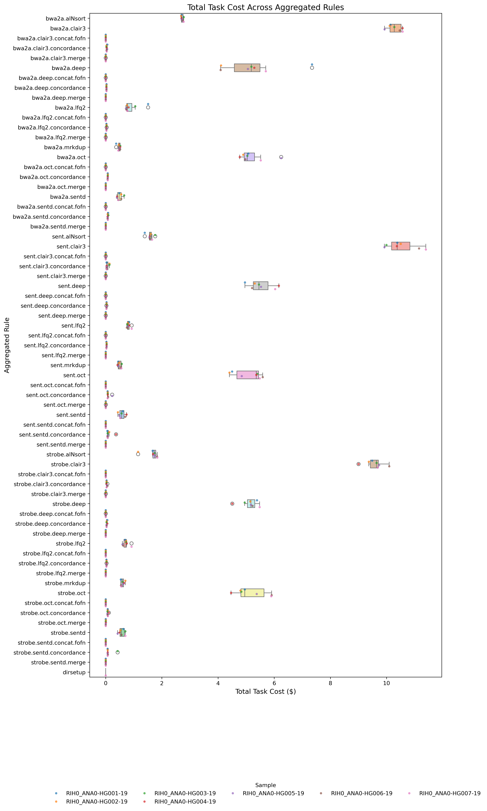
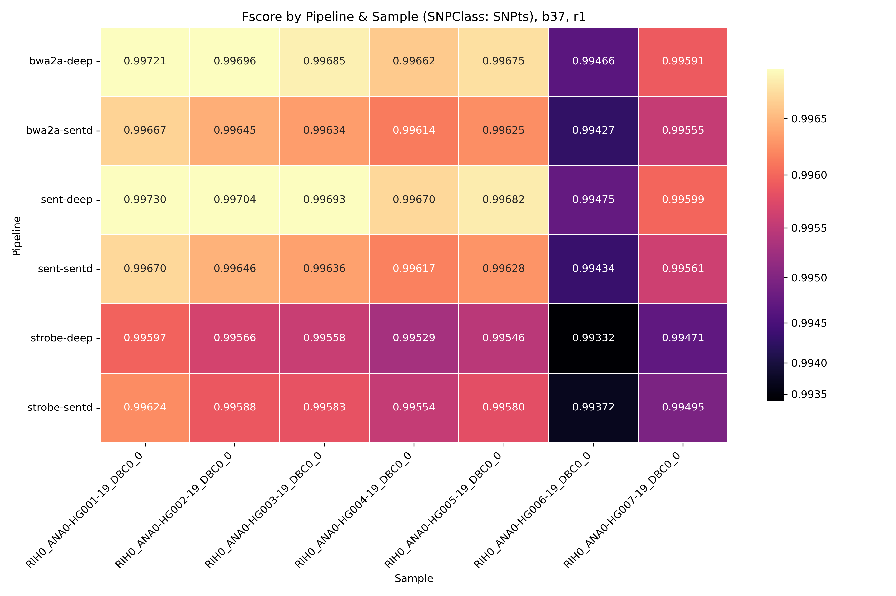
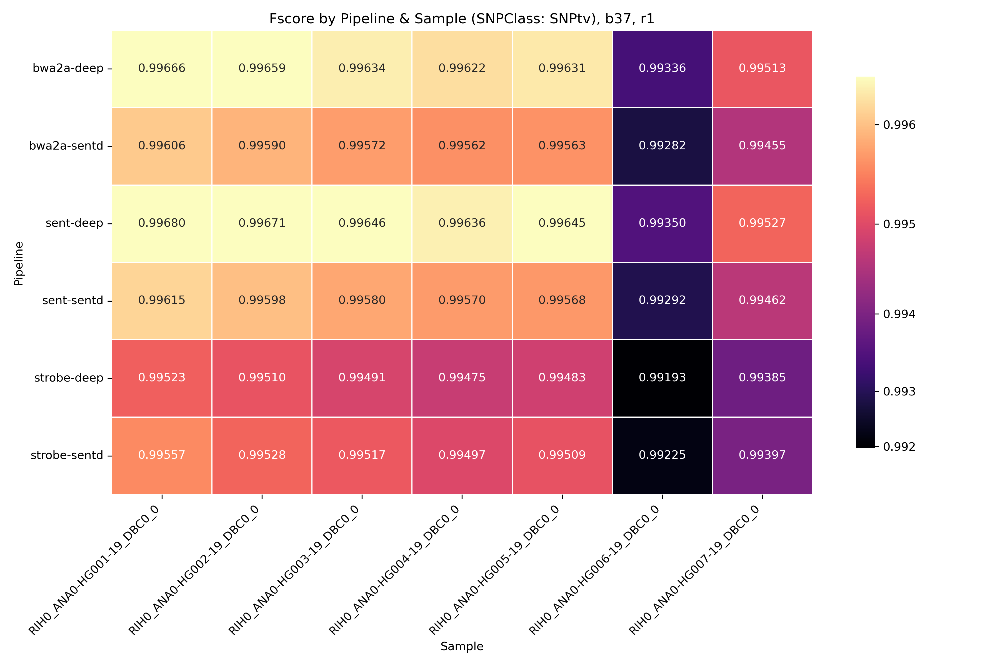
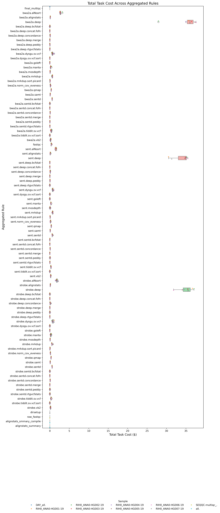

# Investigation of Results For 7 GIAB Samples Processed w/[daylily v0.7.161](https://github.com/Daylily-Informatics/daylily) 
_Running Aligners (`bwa mem2`, `sentieon bwa` & `strobe aligner`) + SNV Callers (`Sentieon DNAscope`, `deepvariant`, `clair3`, `octopus`, `lofreq2`)_

*_WORK IN PROGRESS // raw analysis complete, detailed investigations ongoing (as time permits)_*

---

# Daylily Framework Pipelines Data Sets

## 3 Aligners * 5 SNV Callers (* 3 SV Callers ) + QC Reports

### How To Reproduce Data Used In The Following Analysis
- [Steps to reproduce generating the results used here](docs/creating_dataset.md).

### Datasets Presented Here
_Currently, only variant call concordance, benchmark stats(including costs) and QC reports are exposed here.  The actual BAM/VCFs/etc are available, please contact me if you'd like to grab them._

#### Tool Benchmark Data
Detailed benchmark data is captured per-task, including information on the task instance, costs, and calculated cost to run for each task.

- [Benchmarkf file for 7 GIAB vs/hg38 - just through SNV, using `eu-central-1a` AZ, among lowest priced @ runtime](data/eu_central/hg38_eucentral_benchmarks.tsv )
- [Benchmarkf file for 7 GIAB vs/hg38 - SNV, SV and QC, using `us-west-2c`, which was not lowest priced, but had most robust capacity](data/src_data/hg38_7giab_benchmarks_summary.tsv)

- [Benchmark file for 7 GIAB vs/b37](data/src_data/b37_7giab_benchmarks_summary.tsv)

#### GIAB Concordance Data (for 3 aligners vs 5 SNV callers, so 15 call sets per sample: 105 call sets )
##### hg38
- [Concordance file for 7 GIAB vs/hg38](src/eucentral-1_giab_concordances.tsv )
##### b37 (only 3 aligners vs `sent DNAscope` and `deepvariant`, for cost considerations)
- [Concordance file for 7 GIAB](data/src_data/b37_7giab_allvall_giab_concordance_mqc.tsv)

#### QC Reports
_complete multiqc reports for all samples and all QC tools (there are several)_

> ** download the html files locally and open them in a browser**

- [hg38 Multiqc Report](data/qc_data/hg38_7giab_DAY_final_multiqc.html )
- [b37 Multiqc Report](data/qc_data/b37_7giab_DAY_final_multiqc.html)


# _initial_ Review Of Results

# Producing Plots (come back and stub in the actual commands)

There are three scripts in this repo used to create all plots presented:

```bash
bin/generate_benchmark_plots.py     
bin/generate_concordance_plots.R    
bin/generate_concordance_heatmap.py 
bin/generate_meta_analysis.py
```

# Plots

## `hg38`

## All
- [results/hg38](results/hg38) + `/benchmarks/concordance`

## Concordance Results

### Fscore, `SNPts` by sample, pipeline


### Fscore, `SNPtv` by sample, pipeline


## Costs Per Pipeline
_using AZ ~2.5x > min spot market cost_
*Costs For FQ->SNV*


*Costs For All(using more expensive AZ)*


###

## `b37`

### All
- [results/b37](results/b37) + `/benchmarks/concordance`

### Fscore, `SNPts` by sample, pipeline


### Fscore, `SNPtv` by sample, pipeline



## Costs Per Pipeline
_3 pipelines only_
*Costs For FQ->SNV*


*Costs For All(using more expensive AZ)*

