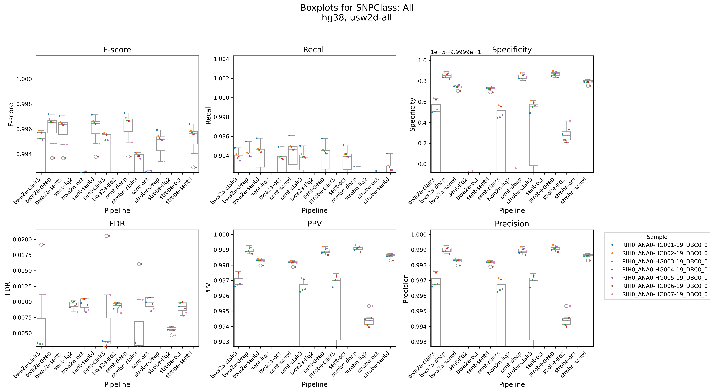
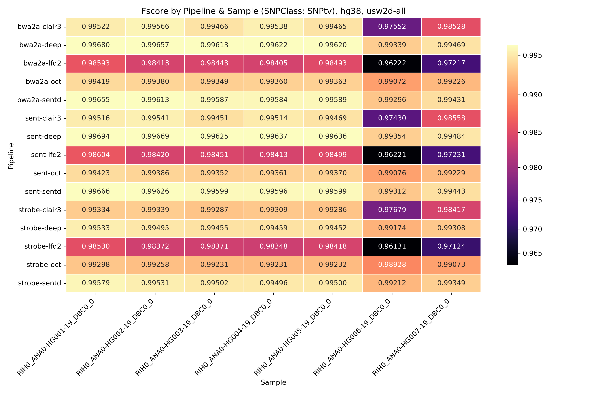
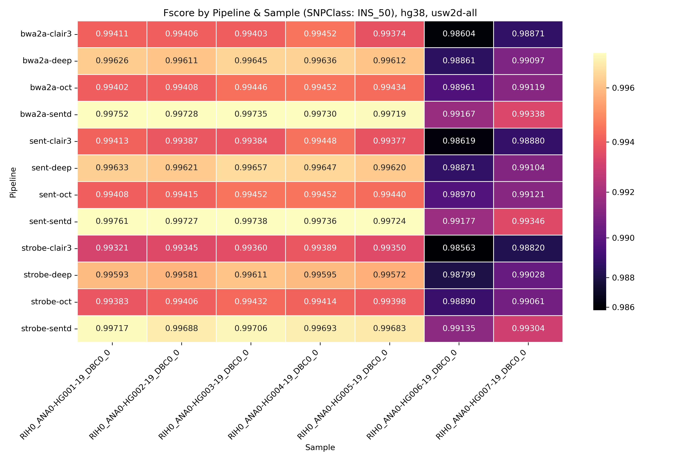
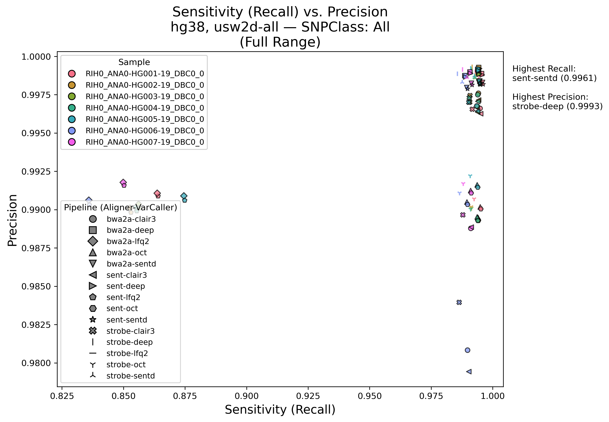
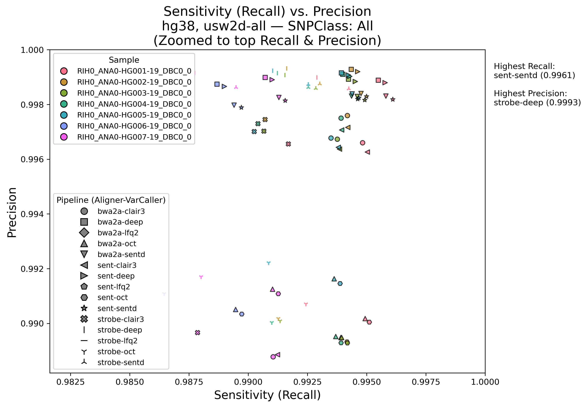

# Daylily Ifx Analysis Framework (GIAB Benchmarking)

# Intention
  > The goal of daylily is to enable more rigorous comparisons of informatics tools by formalizing the compute environment these tools run in, and establishing hardware profiles for tools which will reproduce both accuracy and runtime/cost perofrmance of each tool. This is intended to be a general approach and is not married to any specific toolset (of course AWS is involved. I have not made any design choices which would prevent this work from running outside AWS. AWS does offer the signicant benefit of affording a standardized compute hardware environment anyone who sets up an account may access). I should stress, that by 'compute environment', I mean more than simply offering a container. Containers do not guaruntee hardware perofrmance, and as runtime/cost becomes a significant driver in choosing tooling, we need ways to assert reproducible s/w performance on given hardware. Containers are used throughout daylily, as is conda. I strive to not get too tied to specicif tools. I have three main aims:

## Shift Focus
  Move away from unhelpful debates over “the best” tool and toward evidence-based evaluations. Real use cases dictate tool choice, so let’s make sure relevant data and clear methodologies are accessible—or at least ensure enough detail is published to make meaningful comparisons. Specifically, I wish to move away from scant and overly reductive metrics which fail to describe our tools in as rich detail as they can be. ie:

  > If I am looking for the best possible `recall` in SNV calling, initial data suggestes I might look towards [`sentieon bwa`+`sentieon DNAscope`](https://www.sentieon.com/) ... and interestingly, if I wanted the best possible `precision`, it would be worth investigating [https://github.com/ksahlin/strobealign]`strobealigner`]() + `deepvariant` _[REF DATA](results/us_west_2d/all/concordance/pvr/hg38_usw2d-all__All_zoom.png)_. `Fscore` would not be as informative for these more sepcific cases.

# Raise the Bar
  Demand better metrics and documentation in tool publications: thorough cost data, specific and reproducible hardware details, more nuanced concordance metrics, and expansive QC reporting. Half-measures shouldn’t pass as “sufficient.”

# Escape Outdated ‘Best Practices’
  They were helpful at first, but our field is stuck in 2012. We need shareable frameworks that capture both accuracy and cost/runtime for truly reproducible pipeline performance—so we can finally move forward.

> This repo will hold the analsis from reuslts of the first stable release of `daylily` running on 7 GIAB samples. Again, not only to highlight the tools I've chosen, but to highlight this approach.

---
## Data Preview

> [You can find the full GIAB dataset analysis here- WIP](docs/data/overview.md)

### Concordance Metrics (Fscore, Recall, Precision, FDR, PPV, Sensitivity), by Sample, by Pipeline, by Variant Class 
- [All Plots For hg38-usw2d-all](results/us_west_2d/all/concordance/boxplots)
  

### Heatmaps
- [All Heatmaps For hg38-usw2d-all](results/us_west_2d/all/concordance/heatmaps)

#### SNPts F-scores For 7 30x ILMN GIAB Samples, 3 Aligners, 5 SNV Callers (hg38)

  

#### SNPtv F-scores For 7 30x ILMN GIAB Samples, 3 Aligners, 5 SNV Callers (hg38)

  

#### Insertions < 50bp F-scores For 7 30x ILMN GIAB Samples, 3 Aligners, 5 SNV Callers (hg38)

  

#### Deletions < 50bp F-scores For 7 30x ILMN GIAB Samples, 3 Aligners, 5 SNV Callers (hg38)

  

### Precision vs Recall
- [All PvR For hg38-usw2d-all](results/us_west_2d/all/concordance/pvr)

#### Full Dataset, `All` Variant Classes, All Pipelines

> Best Recall `sentieon bwa`+`sentieon DNAscope` == 0.9961
> Best Precision `strobe aligner`+`deepvariant` == 0.9993

  

#### 'Zoomed' Dataset, `All` Variant Classes, All Pipelines
  

---

## Overview & Goals

1. **Demonstrate the Utility of Daylily**  
   - **Ephemeral** cluster usage: spin up an AWS cluster only when needed, run your WGS analysis, then tear it down to minimize cost.  
   - Built-in **cost tracking**, **spot instance** usage, and **performance metrics**.  

2. **Promote Rigorous Comparison of Tools**  
   - Typically, WGS comparisons omit cost and raw compute details. **Daylily** captures CPU time, wall time, spot pricing, and cost per vCPU second, among other metrics.  
   - The data produced here can help drive cost estimations for your pipeline in the best availability zone.

3. **Streamlined Data & Results**  
   - All raw data (FASTQs, references, alignstats, etc.) are in `./data/`.  
   - Summaries of runtime, cost, coverage, and variant-caller performance are in `./results/`.  
   - MultiQC reports, F-score heatmaps, boxplots, and more provide a comprehensive overview of pipeline performance.

For information on **installing or configuring** Daylily, please see the [Daylily repository](https://github.com/Daylily-Informatics/daylily). This README focuses on reproducing these analyses and showcasing the results, **not** the low-level setup.

---

## Data Sets & Pipeline Configurations

We analyzed **7 GIAB** samples (Illumina, ~30× coverage) on different references (hg38 or b37) in separate AWS regions/clusters, each with distinct aligners, variant callers, and QC steps.

### 1. `hg38_usw2d-all`  
- **Reference**: hg38  
- **Region**: `us-west-2d`  
- **Tools**:  
  - Aligners: **Sentieon BWA**, **BWA-MEM2**, **Strobealign**  
  - SNV Callers: **Sentieon DNAscope**, **DeepVariant**, **Octopus**, **LoFreq2**, **Clair3**  
  - SV Callers: **Manta**, **Tiddit**, **Dysgu**  
  - QC: MultiQC, alignstats + ~14 other tools.  
- **Note**: A resizing event on FSX caused prolonged task hang times, which **inflated** costs and CPU/wall-time metrics for some runs. Cost/timing insights should be drawn from the `eu-central-1c` datasets or the `b37` dataset below.  

### 2. `b37_usw2d-3x2`  
- **Reference**: b37  
- **Region**: `us-west-2d`  
- **Tools**:  
  - **Three aligners**: Strobealign, Sentieon BWA, BWA-MEM2  
  - **Two SNV Callers**: Sentieon DNAscope, DeepVariant  
  - Additional QC: MultiQC, alignstats  + ~14 other tools.  

### 3. `hg38_euc1c-two`  
- **Reference**: hg38  
- **Region**: `eu-central-1c`  
- **Tools**:  
  - **Cluster A**: Sentieon BWA + Sentieon DNAscope  
  - **Cluster B**: BWA-MEM2 + DeepVariant  
- **Goal**: Show ephemeral cluster usage under *ideal conditions* (with spot pricing and no interruptions). This is effectively a smaller targeted run that can be **combined** for cost/CPU comparisons, emphasizing **Daylily**’s cost management features.  

---

## How to Re-Create These Analyses

### Run A`daylily` Ephemeral Cluster
1. **Obtain Daylily** from [its main repository](https://github.com/Daylily-Informatics/daylily).  
2. **Configure** AWS credentials, references (hg38/b37), and your GIAB FASTQ paths in Daylily’s config.  
3. **Process** GIAB FASTQs On An Ephemeral Cluster >> [detailed step-by-step commands may be found here](docs/creating_dataset.md) << , which will guide you through:
   a. **Launch** of an ephemeral cluster via Daylily 
   b. **Run** the WGS pipeline  
      - Executes the alignment, variant calling, and QC steps  
   c. **Review** the final results in `./results/*`, which is where all files used in the analysis to follow will be found.
4. **Mirror** `Fsx` data back to `S3`.
5. **Delete** the ephemieral cluster.

---

## GIAB Benchmark Analysis

### Files & Directories

Each dataset analyzed here includes:

- **`build_annotation_giab_concordance_mqc.tsv`**  
  Contains SNV caller concordance results (F-scores, etc.) by variant class (SNP transitions/transversions, Indels, etc.).  
- **`build_annotation_benchmarks_summary.tsv`**  
  Summaries of runtime, CPU usage, and spot pricing per task—used to derive cost metrics.  
- **Alignstats** (coverage metrics) and (for the two `us_west_2d` runs) **MultiQC** reports.  
- **Consolidated plots** and **tables** inside each subdirectory.

---

### Analysis & Results

Below, we highlight key plots and observations from the **three** main datasets. Additional figures and tables can be found under each dataset’s `concordance/` and `benchmarks/` subdirectories.

### 1. **`hg38_usw2d-all`** (Full Toolset)

> **Goal**: Explore a **broad** matrix of aligners (3) and SNV callers (5) plus multiple SV callers on the 7 GIAB samples (hg38).  

- **Technical Interruption**: A **resizing** of FSX inflated run times for some tasks, leading to higher computed costs.  
- **Interesting Plots**:  
  - **Cost per vCPU-second per GB** boxplots (see `results/us_west_2d/all/concordance/boxplots/`):  
     
    - *Observation:* BWA-MEM2 + DeepVariant shows relatively lower cost per vCPU-second per GB. Strobealign + DNAscope is comparable, but higher standard deviation.  
  - **F-score Heatmaps** (see `heatmaps/`):  
     
    - *Observation:* DNAscope and DeepVariant consistently hit high F-scores for SNP transitions and transversions across samples.  
  - **Precision-vs-Recall** (PVR) plots (`pvr/`):  
     
    - *Observation:* Points cluster near top-right for most aligner+caller combos, but we see slight differences in recall for Indels vs. SNPs.  

Despite the FSX interruption, these runs confirm:
- **High baseline accuracy** for widely used pipelines (BWA + DeepVariant, Sentieon bwa mem + Sentieon DNAscope).  
- Potentially **lower cost** solutions with Strobealign, albeit with some variability 
    > _note_: SNV callers are not tuned to expect strobe aligner alignments, and I expect there is significant room for improvement.  Given it's disadvantage, it's performance out of the box is quite encouraging.  

### 2. **`b37_usw2d-3x2`** (Three Aligners × Two Callers)

> **Goal**: Evaluate a smaller matrix (3 aligners × 2 SNV callers) against b37-based GIAB data in `us_west_2d`.  

- **Benchmarks**:  
  - **Faster** alignments with BWA-MEM2 than with older BWA in some tasks.  
  - Slightly **higher coverage** variance with Strobealign.  
- **Concordance**:  
  - **DeepVariant** typically edges out DNAscope in terms of SNP recall on certain GIAB samples, though the difference is small.  
  - Indel F-scores are relatively similar for both.  
- **Costs**:  
  - Overall lower than the `hg38_usw2d-all` set, due to fewer pipeline steps and no major FSX interruptions.  
  - Boxplots in `benchmarks/` show cost scaling with CPU time but remaining within typical spot pricing bounds.  

### 3. **`hg38_euc1c-two`** (Two Minimal Pipelines in `eu_central_1c`)

> **Goal**: Show ideal ephemeral usage for two minimal pipelines on 7 GIAB samples with the hg38 reference:  
> 1) **Sentieon BWA + DNAscope**,  
> 2) **BWA-MEM2 + DeepVariant**.  

- **Separate Clusters**: Each pipeline was run on a separate ephemeral cluster at spot pricing in `eu_central_1c`.  
- **Highlights**:  
  - **Lower overall cost** because the cluster spooled up only for these specific tasks, then shut down.  
  - **Daylily**’s cost-tracking reveals consistent spot pricing across tasks, with minimal idle times.  
- **Comparisons**:  
  - Aligners performed comparably for coverage on these GIAB samples.  
  - **DNAscope** vs. **DeepVariant** differences remain subtle but show up in some variant classes—check `concordance/raw_metrics` for exact precision/recall.  

This dataset underscores **Daylily**’s ephemeral cluster approach. The ability to **create** and **destroy** a cluster quickly, with tasks tracked by cost, was highly effective for controlling expenses.

---

## Additional Figures & Tables

- **`concordance/boxplots/`**  
  Side-by-side boxplots for cost, F-scores, coverage distribution, etc.  
- **`concordance/heatmaps/`**  
  Heatmaps covering per-tool performance across variant classes.  
- **`concordance/pvr/`**  
  Precision vs. Recall (P/R) curves for each pipeline.  
- **`benchmarks/`**  
  Summaries of CPU/wall time per Snakefile rule, cost breakdowns, and spot instance logs.  

Feel free to explore the **raw_metrics** subfolders for CSV/TSV data if you want to do further custom analysis or re-plot these metrics.

---

## Concluding Thoughts & Next Steps

These three data sets illustrate how **Daylily**:

- **Unifies** alignment, variant calling, SV detection, and QC in a cost effective, highly observable, scalable, rigourously reproducible hardware environment paired with tools optimized for this hardware environment. The magic is more in the approach to hardware-software management than in the workflow itseld (NOTE: daylily can already run `CROMWEL` workflows and it is reasonably trivial to enable other workflow managers)
- **Captures** _&_ **Predicts** cost, CPU, coverage, and F-score metrics **in one place**.  
- **Scales** from smaller targeted runs (`hg38_euc1c-two`) to comprehensive tool comparisons (`hg38_usw2d-all`) and should be able to handle 1000's of genomes in parallel per-cluster (given appropriate quotas and so on).  

**Next Steps**:

1. Integrate final results and plots into a **whitepaper** or preprint (see the [whitepaper sketch](https://github.com/Daylily-Informatics/daylily/tree/main/docs/whitepaper)).  
2. Include additional variant callers (e.g., GPU-accelerated) or references for broader coverage.  
3. Expand cost-estimator logic to automatically recommend an optimal AWS region or instance type based on real-time pricing.

**Questions or Contributions**:  
- Please open an issue or pull request in [this repository](https://github.com/Daylily-Informatics/daylily_giab_analyses).  
- For Daylily-specific usage, see the [main Daylily repo](https://github.com/Daylily-Informatics/daylily).

---

*Last updated: February 2025*