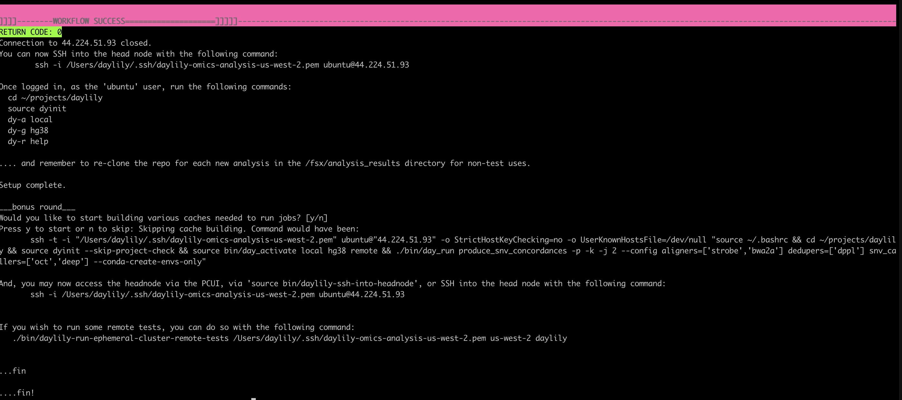
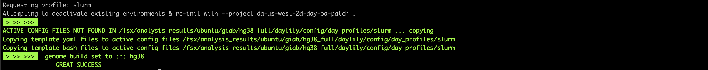

# daylily_giab_analyses ( a detailed treatment of results produced by [the daylily omic analysis framework](https://github.com/Daylily-Informatics/daylily) )

*_WORK IN PROGRESS // EXPECT DATA TO CHANGE AS CLEANER RUNS COME IN_*

---

## This Reopo

Contains the scripts used to analyze the `0.7.161` `daylily` dataset. 

### Conda Environment

Create it with:

```bash
conda create  -n DAYGIAB -c conda-forge python ipython pandas r-base matplotlib r-ggplot2 r-dplyr r-tidyr seaborn r-readr  r-argparse
conda activate DAYGIAB

```

---

## `bin` Dir Scripts
The bin directory contains the scripts to analyze the three meta-artifact files produced when you [follow the steps below](#daylily-version-07161).

### Process Benchmarks Data

#### Create Working Files & Plots
ie:
```bash
python bin/generate_benchmark_plots.R data/src_data/hg38_7giab_benchmarks_summary.tsv hg38 0.7.161
```

> produces data files and plots, found in `results/{hg38,b37}`.


### Process Concordance Data Files + Plots
ie: 
```bash
Rscript bin/generate_concordance_plots.R hg38 data/src_data/hg38_7giab_allvall_giab_concordance_mqc.tsv
```
> produces data files and plots, found in `results/{hg38,b37}`.


---
---

# `daylily` version `0.7.161`
- [`daylily` version `0.7.161`](https://github.com/Daylily-Informatics/daylily/releases/tag/0.7.161)

[Was the version of the daylily ephemeral cluster and omics analysis framework used to build the compute resources and produce the following results](https://github.com/Daylily-Informatics/daylily/releases/tag/0.7.161).

## S3 Full Data Set

`s3://daylily-service-omics-analysis-us-west-2/FSxLustre20250123T214325Z/analysis_results/ubuntu/`

  > You will need to request access from me using `john@dyly.bio`.

---

## Cluster Creation

### Determine Most Cost Effective Region
_on your laptop	or whatnot_
```bash
conda activate DAYCLI

export AWS_PROFILE=daylily

./bin/check_current_spot_market_by_zones.py --profile $AWS_PROFILE -o ./day_clu_cost_predictions.tsv

```

Will produce cost estimate details for the specified availability zones. For example:

~[](docs/images/cost_predictions.png)

### Create An Ephemeral Cluster
_on your laptop or whatnot_

```bash
conda activate DAYCLI
export AWS_PROFILE=default
```

Will block the terminal and print status messages for ~20min, ie:

~[](docs/images/cluster_create.png)

Then when complete, will let you know the ssh command necessary to ssh into the headnode (which, you may also do via SSM in the EC2 dashboard, via the AWS Parallel Cluster UI(PCIUI). The commands are the same regarless of your connection method of choice, and looks like this:

```bash
ssh -i /Users/daylily/.ssh/daylily-omics-analysis-us-west-2.pem ubuntu@44.224.51.93
```




---

## Run Complete `daylily` WGS Analysis


### With Genome Build `hg38`
_from headnode_

```bash

mkdir -p /fsx/analysis_results/ubuntu/giab/hg38_full
cd /fsx/analysis_results/ubuntu/giab/hg38_full

tmux new -s hg38_full

git clone https://github.com/Daylily-Informatics/daylily.git
cd daylily
. dyinit
dy-a slurm hg38

# copy the canned giab analysis ref reads. In practice, you will use a daylily helper script to create each `analysis_manifest.csv`
cp .test_data/data/giab_30x_hg38_analysis_manifest.csv config/analysis_manifest.csv

dy-r produce_multiqc_final_wgs produce_snv_concordances produce_tiddit produce_manta produce_dysgu -p -k -j 1000 --config aligners=["bwa2a","sent","strobe"] dedupers=["dppl"]  snv_callers=["deep","clair3","oct","sentd","lfq2"] sv_callers=["manta","tiddit","dysgu"] -n

# The first time a tool is executed on the cluster, its env is pulled or built and cached, so this first run will spend some time pulling envs (this can take an hour or more as we are pulliug in all of the data processing and MANY qc tools), future runs will not need to do this.

dy-r produce_multiqc_final_wgs produce_snv_concordances produce_tiddit produce_manta produce_dysgu -p -k -j 1000 --config aligners=["bwa2a","sent","strobe"] dedupers=["dppl"]  snv_callers=["deep","clair3","oct","sentd","lfq2"] sv_callers=["manta","tiddit","dysgu"]

```


#### Actvating The Slurm Executor using `hg38`

**note:** The benchmark data for this entire run is not representative b/c I mistakenly resized the FSX filesystem while everything was running full tilt. This caused zero job failures, but many jobs were hung for hours as FSX expanded and fought for IO wiht these 1000's of jobs.  Accuracy data is fine. Mostly, strobe aligner and deep variant were the impacted jobs.

Will look like:



#### `dryrun`
The dryrun flag, `-n`, produces a plan for the workflow, which I always run as a sanity check before launching large jobs, and this looks like :


Upon successful completion, you should see this:


#### Results

Are found in `results/day/hg38/`

```bash

tree -d	results/day/hg38

```


### With Genome Build `b37`
_from headnode_

> This may be done in parallel with the `hg38` jobs if you wish, they will be scheduled together if you run concurrently.

```bash

mkdir -p /fsx/analysis_results/ubuntu/giab/b37_full
cd /fsx/analysis_results/ubuntu/giab/b37_full

tmux new -s b37_full

git clone https://github.com/Daylily-Informatics/daylily.git
cd daylily

. dyinit
dy-a slurm b37

# copy the canned giab analysis ref reads. In practice, you will use a daylily helper script to create each `analysis_manifest.csv`
cp .test_data/data/giab_30x_b37_analysis_manifest.csv config/analysis_manifest.csv

dy-r produce_multiqc_final_wgs produce_snv_concordances produce_tiddit produce_manta produce_dysgu -p -k -j 1000 --config aligners=["bwa2a","sent","strobe"] dedupers=["dppl"]  snv_callers=["deep","clair3","oct","sentd","lfq2"] sv_callers=["manta","tiddit","dysgu"] -n


dy-r produce_multiqc_final_wgs produce_snv_concordances produce_tiddit produce_manta produce_dysgu -p -k -j 1000 --config aligners=["bwa2a","sent","strobe"] dedupers=["dppl"]  snv_callers=["deep","clair3","oct","sentd","lfq2"] sv_callers=["manta","tiddit","dysgu"] 

```

* Workflow success should looks the same as for hg38

##### Results

Are found in `results/day/b37/`

```bash

tree -d results/day/b37

```

---

## Migrate Data Back From The Cluster To S3
To persist your work in `/fsx/analysis_results/ubuntu` back to the S3 bucket which was mounted to the fsx filesystem.
```bash
bin/daylily-export-fsx-to-s3 day-oa-patch us-west-2 analysis_results/ubuntu
# Usage: bin/daylily-export-fsx-to-s3 <cluster_name> <region> <export_path:analysis_results>
```

This will block the terminal as the FSX data under `/fsx/analysis_results/ubuntu` is mirrored back to the daylyily ref bucket.  If you loose the terminal, the job will not be interrupted.

* NOTE: this is not meant to be the final home for these data, just a quick and fast way to move these data for free. Develop a plan for long term analysis data storage that suits your needs.

* NOTE2: fsx export will do incremental exports. If you specify the same root path 2x, it will not move files which have not been changed since the last export.

---

## Delete The Ephemeral Cluster

```bash
bin/daylily-delete-ephemeral-cluster
```

> Will prompt for the `region` and `cluster name`.

Be sure you have exported the analysis work you wish to preserve back to S3.  This script will warn if there is an fsx filesystem attached to the headnode. You will be asked to force delete if this is the case.


* This will block the terminal until deleted. If you loose the terminal, the job will not be interrupted.

---

## Review Cluster Costs
_from aws console_

- Each cluster has resource tagging to allow exquisite cost tracking of all resources involved in creating, running and deleting these clusters.

- NOTE: costs can take a day or so to be fully reflected by AWS, this seems to not be the case for resources the cluster uses, but be aware there is potentially lag time in reporting.

- Navigate to the `Cost Analysis` dashboard.

- Set filters for: XXXXX

---
---

# `daylily` Analysis Results
---
## Data Organization
---
### Directories

> here

### File Naming

> here


---

## QC Data

> Multiqc wraps it all up

### `hg38`

_download and open the html file in a browser locally_
* [hg 38 multiqc full report](data/qc_data/hg38_7giab_DAY_final_multiqc.html)

### `b37`
_download and open the html file in a browser locally_
* [hg 38 multiqc full report](data/qc_data/b37_7giab_DAY_final_multiqc.html)


---

## Compute Resource Benchmarking And Cost Reporting

`daylily` tracking benchmark performance for all tasks it runs, and in real time pulls the EC2 spot information, including price the spot costs, and with this information, calculates the efficency of each jobs use of the requested instance resources, as well as the COST for each task. Allowing identification of inefficent and cost driving tasks (which are often not what one would immediately predict).

> Plots


---

## SNV Concordance

> here


# In Closing

> here

---
---


# Targeted Case Study

---

## Ran Spot Price Model

Check the current pricing situation across AZs.

```bash
export AWS_PROFILE=default
conda activate DAYCLI
python bin/check_current_spot_market_by_zones.py --profile $AWS_PROFILE -o ./spot_check.tsv
```

> Extract the aws region-az you wish to use from this table.

---

## Created Ephemeral Cluster in `ap-south-1c`

```bash
export AWS_PROFILE=default
bin/daylily-create-ephemeral-cluster --profile $AWS_PROFILE --region-az ap-south-1a
```

---

## SSH To Headnode
_not limited to ssh, also viable: SSM via the EC2 dashboard and the PCUI web dasboard._

```bash
ssh -i /Users/daylily/.ssh/daylily-omics-analysis-ap-south-1.pem ubuntu@3.7.155.236
```

---

## Create Analysis Dirs

```bash
mkdir -p /fsx/analysis_results/ubuntu/{hg38/slim_test,b37/slim_test}
cd  /fsx/analysis_results/ubuntu/hg38/slim_test

git clone https://github.com/Daylily-Informatics/daylily.git
cd daylily

```

---

## `hg38` analysis of all 7GIAB ONLY `bwamem2`, `doppelmark`, `deepvariant`

```bash

tmux new -s hg38_slim

cp .test_data/data/giab_30x_hg38_analysis_manifest.csv config/analysis_manifest.csv

. dyinit
dy-a slurm hg38

dy-r produce_snv_concordances  -p -k -j 1000 --config aligners=["bwa2a"] dedupers=["dppl"]  snv_callers=["deep"] -n

dy-r produce_snv_concordances  -p -k -j 1000 --config aligners=["bwa2a"] dedupers=["dppl"]  snv_callers=["deep"] 

```

### Results

> here

---

## `b37`  analysis of all 7GIAB ONLY `bwamem2`, `doppelmark`, `deepvariant`

```bash

cd  /fsx/analysis_results/ubuntu/b37/slim_test

tmux new -s b37_slim

git clone https://github.com/Daylily-Informatics/daylily.git
cd daylily

. dyinit
dy-a slurm b37

cp .test_data/data/giab_30x_b37_analysis_manifest.csv config/analysis_manifest.csv

dy-r produce_snv_concordances  -p -k -j 1000 --config aligners=["bwa2a"] dedupers=["dppl"]  snv_callers=["deep"] -n

dy-r produce_snv_concordances  -p -k -j 1000 --config aligners=["bwa2a"] dedupers=["dppl"]  snv_callers=["deep"] 


```


### Results

> here

