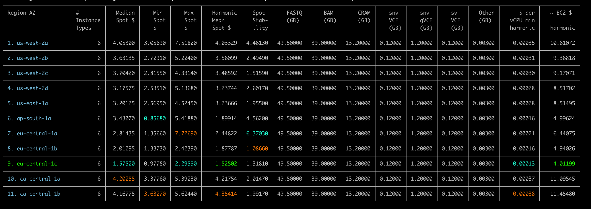
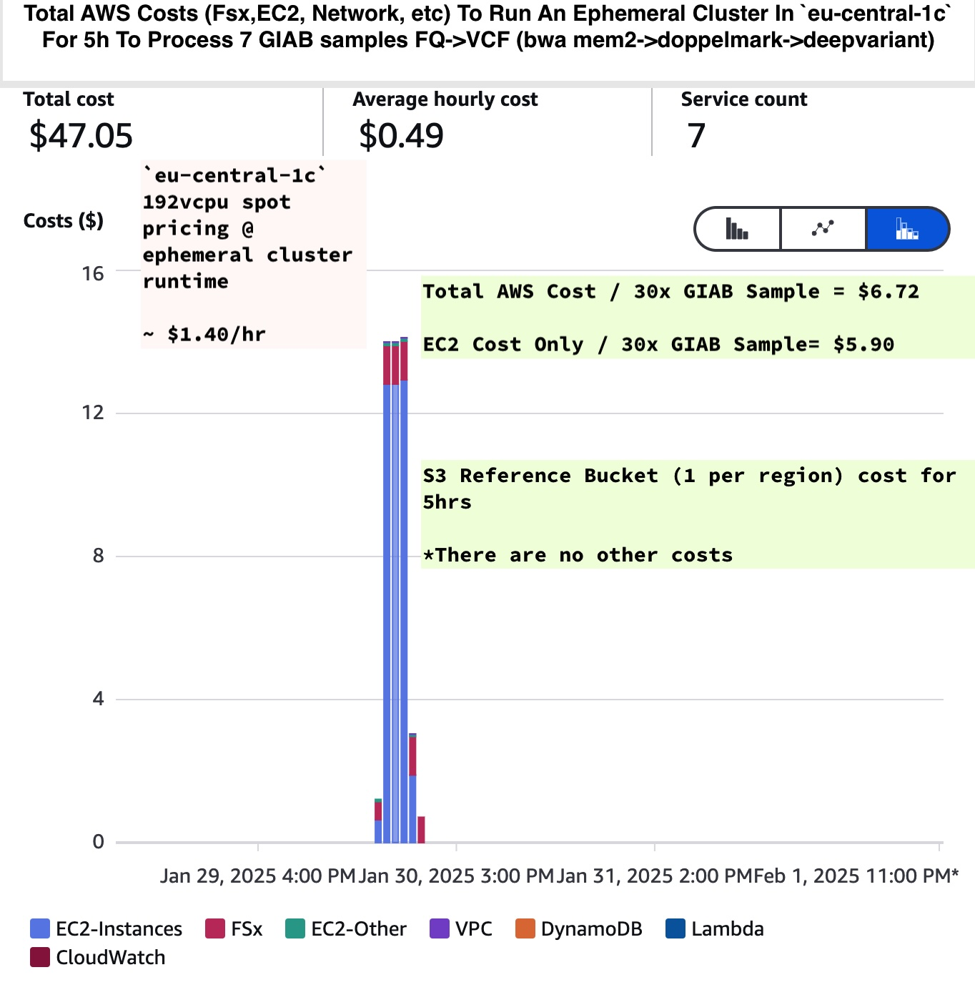

# Investigation of Results For 7 GIAB Samples Processed w/[daylily v0.7.161](https://github.com/Daylily-Informatics/daylily) 
_Running Aligners (`bwa mem2`, `sentieon bwa` & `strobe aligner`) + SNV Callers (`Sentieon DNAscope`, `deepvariant`, `clair3`, `octopus`, `lofreq2`)_

*_WORK IN PROGRESS // raw analysis complete, detailed investigations ongoing (as time permits)_*

---
---

# Daylily Framework Pipelines Data Sets

## How To Reproduce Data Used In The Following Analysis
- [Steps to reproduce generating the results used here](docs/creating_dataset.md).


---

## References
`daylily` relies on a [S3 bucket](https://github.com/Daylily-Informatics/daylily?tab=readme-ov-file#daylily-references-public-reference-bucket) which contains all necessary refrences, bioinformatics tool artifacts, genomic annotations, giab fastqs, etc.

---

## Data Types

### Raw Data
_available upon request, until I have these files available in a cost effective way_

- Available: all files produced by [`daylily`](https://github.com/Daylily-Informatics/daylily) (aligner BAM, snv+sv VCFs, logs, etc).


### QC Data (multiqc)
A large number of QC tools are used to offer insight into each workflow. These tools are aggregated into a final html reports with `multiqc`.

> Ephemeral cluster cost monitoring is fully integrated with `daylily`, down to the task/job level. QC reports include a header with summary info re:costs to run a given analysis (more detailed cost reporting to be integrated into multiqc).
>
> 

### Alignstats Data
[Alignstats](https://github.com/jfarek/alignstats) is a tool which calculates extensive (*163*!) metrics for BAM/CRAM files. 

- [hg38_us-west-2d_alignstats](data/us_west_2d/hg38_7giab_us-west-2d_alignstats.tsv)
- [b37_us-west-2d_alignstats](data/us_west_2d/b37_7giab_us-west-2d_alignstats.tsv)
- _Alignstats was not run for `eu-central-1c`, but is expected to be exactly the same as `hg38_us-west-2d` above_.


### Concordance Data (for both `hg38` and `b37`)
`daylily` automatically will caclulate concordrance metrics for each sample for which there has been a truthset `vcf` specified.

The following annotations/metrics are presented in the concordance results file:
    > - SNPClass	
    > - Sample	
    > - TgtRegionSize	
    > - TN	
    > - FN
    > - TP	
    > - FP	
    > - Fscore	
    > - Sensitivity-Recall	
    > - Specificity	
    > - FDR	
    > - PPV	
    > - Precision	

SNPClass segments stats per sample as (categories defined by `bcfstats`):
  > - All
  > - SNPts
  > - SNPtv
  > - Ins_50
  > - Ins_gt50
  > - Del_50
  > - Del_gt50
  > - Indel_50
  > - Indel_gt50

With the GIABid, aligner and snv caller annotated as well.

### Benchmark + Cost Data

Spot instance compute benchmark metrics are tracked per-task, including spot instance type details and the cost to run each task.  The benchmark summary file includes the following columns:

  > - sample	
  > - rule	
  > - s	
  > - h:m:s	
  > - max_rss	
  > - max_vms	
  > - max_uss	
  > - max_pss	
  > - io_in	
  > - io_out	
  > - mean_load	
  > - cpu_time	
  > - hostname	
  > - ip	
  > - nproc	
  > - cpu_efficiency	
  > - instance_type	
  > - region_az	
  > - spot_cost	
  > - snakemake_threads	
  > - task_cost


---

## Summary Data Available

### hg38

#### `us-west-2d`
**This region-az was chosen for expediency vs cheapest spot market cost**

> `daylily` relies almost exclusively on `192 vcpu` instances. At the time this workflow was executed, the harmonic mean of spot prices for these instances was ~$3.60/hr. I chose this AZ b/c I have a far greater spot instance quota to run in this region.

All 7 GIAB 30x google brain Illumina reads were processed via complete `daylily` WGS analysis framework. All FASTQs were mapped with 3 aligners (`sentieon bwa`, `bwa mem2` & `strobe aligner`). Each BAM was SNC called with 5 variant callers (`Sentieon DNAscope`, `deepvariant`, `octopus`, `clair3`, `lofreq2`), and SVs called with three SV callers (`manta`, `tiddit`, `dysgu`). Finally, ~ 14 QC tools were executed and each workflow run captured in a single multiqc report.


##### Concordance Data

- [hg38_us-west-2d_concordance.tsv](data/us-west-2d/hg38_7giab_us-west-2d_giab_concordance_mqc.tsv)

##### Benchmark & Cost Data

- [hg38_us-west-2d_benchmarks.tsv](data/us-west-2d/hg38_7giab_us-west-2d_benchmarks_summary.tsv)

##### QC (multiqc) Reports
_download these `html` files and open in a new browser_

- [hg38 Multiqc Report](data/us-west-2d/qc_data/hg38_us-west-2d_DAY_final_multiqc.html) _note: cost data summary is borked_


#### `eu-central-1c`
**This region-az was chosen as one of the cheapest spot markets**

To demonstrate running in a different, very cheap AZ, only `bwa mem2` and `deepvariant` were run on all 7 GIAB samples.

> The harmonic mean cost of running in this AZ was ~$1.5/hour. *note:* the lowest spot pricing I have seen is ~0.80/hr for these instance types.

##### Concordance Data

- [eu-central_concordance.tsv](data/eu_central-1c/hg38_eu-central-1c_giab_concordances.tsv)

##### Benchmark & Cost Data

- [eu-central_benchmarks.tsv]](data/eu_central-1c/hg38_eu-central-1c_benchmarks.tsv)

##### QC (multiqc) Reports
_QC tools not run for this data set_


### b37
In the interest of saving $, I only ran the winning pipelines from the `hg38` trials. Aligners (`sentieon bwa` & `bwa mem2`) & SNV callers (`sentieon DNAscope` and `deepvariant`). All QC tools were executed and a multiqc report produced.

> Spot instance costs ~$3.60/hr.

#### `us-west-2d`
**The b37 analysis was queued up in parallel with the `hg38` jobs, and all run on the same ephemeral cluster in the same region$**

- [data files here](data/us-west-2d)

##### Concordance Data

- [us-west-2d_b37_benchmarks.tsv](data/us-west-2d/b37_7giab_us-west-2c_benchmarks_summary.tsv)

##### Benchmark & Cost Data

- [us-west-2d_b37_concordance.tsv](data/us-west-2d/b37_7giab_us-west-2c_benchmarks_summary.tsv)


##### QC (multiqc) Reports
_download these `html` files and open in a new browser_

- [b37 Multiqc Report](data/us-west-2d/qc_data/b37_us-west-2d_DAY_final_multiqc.html)


--- 
___


# _initial_ Analysis of Data Sets
The following is a *WIP*.

## TLDR;

### Winners For `FASTQ->SNV.vcf` Pipelines

#### hg38

> **Fastest Walltime** :
>   - `sentieon bwa` + `doppelmark dups` + `sentieon DNAscope` == ** _x hr x min_**
>
> **Cheapest Compute Cost (aka, cpu time required)** :
> _liscencing fees required (and not reflected in the cost below)_
>   - `sentieon bwa` + `doppelmark dups` + `sentieon DNAscope` == ** _x hr x min_**
>   - `sentieon bwa` + `doppelmark dups` + `sentieon DNAscope` == ** _x hr x min_** 
>
> **Cheapest In Flight Storage + Other Non Compute Costs** :
>   Largely the same for each tool. What will matter is your decision regarding what data formats you choose and if you retain duplicated data (ie: retaining FASTQ once you have produced BAMs that contain the same data as the input fastq)
> 
> **Cheapest Long Term Storage + Other Non Compute Costs** :
>  See above category.
> 
> **Best Fscore All SNV Classes** :
>   - `sentieon bwa` + `doppelmark dups` + `sentieon DNAscope` == ** _x hr x min_** 
>
> **Best Recall** :
>   - `sentieon bwa` + `doppelmark dups` + `sentieon DNAscope` == ** _x hr x min_** 
>
> **Best Sensitivity** :
>   - `sentieon bwa` + `doppelmark dups` + `sentieon DNAscope` == ** _x hr x min_** 
>
> **Best Longterm Reproducibility**
>   - (`bwa mem2` + `strobe aligner`) _ `doppelmark dups` + (``,``,``,``), _note:_ I am following up with Sentieon re: their long term reproducibility plan.
>
> 

---
---

# Concordance Analysis 


## Producing Plots 

[see installing CONDA env here](docs/creating_dataset.md)

```bash

conda activate DAYGIAB
mkdir -p results/{us_west_2d,eu_central_1c}/{concordance,benchmarks}

# Base Concordance Metrics
Rscript bin/generate_concordance_plots.R hg38 data/us_west_2d/hg38_7giab_us-west-2d_giab_concordance_mqc.tsv usw2d

Rscript bin/generate_concordance_plots.R b37 data/us_west_2d/b37_7giab_us-west-2d_giab_concordance_mqc.tsv usw2d

Rscript bin/generate_concordance_plots.R hg38 data/eu_central_1c/hg38_eu-central-1c_giab_concordances.tsv euc1c

mv plot_hg38_usw2d_* results/us_west_2d/concordance
mv plot_hg38_euc1c_* results/eu_central_1c/concordance
mv plot_b37_usw2d_* results/us_west_2d/concordance


# HEATMAPS
python bin/generate_concordance_heatmap.py data/us_west_2d/hg38_7giab_us-west-2d_giab_concordance_mqc.tsv hg38 usw2d
 
python bin/generate_concordance_heatmap.py data/us_west_2d/b37_7giab_us-west-2d_giab_concordance_mqc.tsv b37 usw2d

python bin/generate_concordance_heatmap.py data/eu_central_1c/hg38_eu-central-1c_giab_concordances.tsv hg38 euc1c

mv heatmap_*usw2d* results/us_west_2d/concordance
mv heatmap_*euc* results/eu_central_1c/concordance

# Benchmarks Cost/Runtime
python bin/generate_benchmark_plots.py data/us_west_2d/hg38_7giab_us-west-2d_benchmarks_summary.tsv hg38 usw2d
 
python bin/generate_benchmark_plots.py data/us_west_2d/b37_7giab_us-west-2d_benchmarks_summary.tsv b37 usw2d

python bin/generate_benchmark_plots.py data/eu_central_1c/hg38_eu-central-1c_benchmarks.tsv hg38 euc1c

mv euc1c_hg38_* results/eu_central_1c/benchmarks
mv usw2d_* results/us_west_2d/benchmarks


# Meta Analysis
python bin/generate_meta_analysis.py -b 


```

---

## Fundamental Metrics Dot Plots, by Pipeline & Sample

### hg38 `us-west-2d`

- [To review all of the raw concordance metrics plotted per sample & pipeline, see the pngs in this direcotry]().

### hg38 `eu-central-1c`

- [To review all of the raw concordance metrics plotted per sample & pipeline, see the pngs in this direcotry]().

### b37 `us-west-2d`

- [To review all of the raw concordance metrics plotted per sample & pipeline, see the pngs in this direcotry]().

---

## Heatmaps

### hg38 `us-west-2d`


#### `SNPts` Fscore By Pipeline & Sample


#### `SNPtv` Fscore By Pipeline & Sample


#### (``,``,``,``) By Pipeline & Sample

- []()
- []()
- []()


### hg38 `eu-central-1c`

#### `SNPts` Fscore By Pipeline & Sample


#### `SNPtv` Fscore By Pipeline & Sample


#### (``,``,``,``) By Pipeline & Sample

- []()
- []()
- []()

### b37 `us-west-2d`

#### `SNPts` Fscore By Pipeline & Sample


#### `SNPtv` Fscore By Pipeline & Sample


#### (``,``,``,``) By Pipeline & Sample

- []()
- []()
- []()

---

## Recall vs Sens, by Pipeline & Sample


### hg38 `us-west-2d`

### All Data Points


#### Best Performers


### hg38 `eu-central-1c`

### All Data Points


#### Best Performers


### b37 `us-west-2d`

### All Data Points


#### Best Performers


---

## Compute and Cost Benchmark Data


### hg38 `us-west-2d`
#### `cpu time`


#### `wall time`


#### Spot Instance Compute Cost per Task per Sample


### hg38 `eu-central-1c`
#### `cpu time`


#### `wall time`


#### Spot Instance Compute Cost per Task per Sample


### b37 `us-west-2d`

#### `cpu time`


#### `wall time`


#### Spot Instance Compute Cost per Task per Sample


---
---

# Case Study

## Select An AZ With Favorable Spot Pricing, Analyze There!

From the [daylily repo](), generate a spot instance pricing report.

```bash
 python bin/check_current_spot_market_by_zones.py --profile $AWS_PROFILE -o ./sentieon_case_study.csv --zones us-west-2a,us-west-2b,us-west-2c,us-west-2d,us-east-1a,ap-south-1a,eu-central-1a,eu-central-1b,eu-central-1c,ca-central-1a,ca-central-1b
 ```
  - [Spot market pricing data](data/sentieon_case_study.tsv).

  

  > `eu-central-1c` has been among the cheapest and with reasonable stability for a few weeks. Proceed with this AZ to create an ephemeral cluster, run analysis, and clean it up when idle. **see daylily repo docs for how to create and run an ephemeral cluster**.


## BWA MEM2 + DEEPVARIANT // Complete Ephemeral Cluster Cost Analysis _for_ 7 30x GIAB Samples, FASTQ->snv.VCF (bwa mem2, doppelmark, deepvariant)

### $5.90 EC2 Costs per Sample // $6.72 Fully Burdened AWS Ephemeral Cluster Cost per Sample

`daylily` tracks every AWS service involved in creating, running and tearing down ephemeral clusters. Below is the complete cost of running an ephemeral cluster to analyze 7 GIAB 30x fastq files using a `bwa mem2`+`doppelmark duplicates`+`deepvariant` pipeline. In this case, running vs `hg38`.

> This ephemeral cluster was created in AZ `eu-central-1c` as it had a very favorable spot market for the `192vcpu` spot instances daylily relies upon, which cost **~$1.40/hr** at that time. 

> This AZ had quota restrictions on how many spot instances could be run at one time, so it existed for 5hr. 
>   - Fully parallelized without quota restrictions, the cluster would have completed processing in **1h 40m**.

  

  - `total AWS cost` (EC2, Fsx, networking, etc) to run this cluster = **$47.05**
    - `total EC2 compute` cost = **$41.50**
      - `active EC2 compute` cost as calculated from [hg38_eu-central-1c_benchmarks.tsv](data/eu_central_1c/hg38_eu-central-1c_benchmarks.tsv) = **$36.33**
      - `idle EC2 compute` cost (`total EC2`-`active EC2`) = **$5.17** (_12% idle_)
        - Idle time are vcpu seconds not actively in use by a job/task. 12% likely represents an upper bound, as this cluster was not running at capacity, and many jobs ran on partially utilized instances. This time can be dialed back by reducing the time threshold to teardown idle spot instances.


## SENTIEON // Complete Ephemeral Cluster Cost Analysis _for_ 7 30x GIAB Samples, FASTQ->snv.VCF (sentieon bwa mem, doppelmark, sentieon DNAscope)

